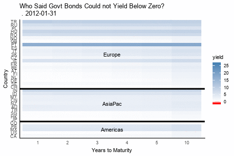

#Below Zero is an Option

Set starting parameters.

```{r, message=FALSE, warning=FALSE}
library(ggplot2)
library(tidyverse)
library(magick) #animation and GIF creation
library(Rblpapi) #bloomberg
library(lubridate)
START_DATE =  as.Date("2012-01-01","%Y-%m-%d")
END_DATE = Sys.Date()
BDH_OPTIONS = c("periodicitySelection"="MONTHLY")

#specify which maturities to get from the bbg yield curve vector
#this assumes the column positions the tenors are in
curveTenors<-data.frame(bbgColumns=c(3,4,5,6,7,11),tenors=factor(c(1,2,3,4,5,10)))
allSecTickers<-data_frame()
#load a csv file with the names of the BBG yield curve tickers for the countries we want
#Of the format: Ticker,Index Name,Region,CountryISO
curveTickers<-read.csv("curve tickers.csv",stringsAsFactors = FALSE)

```
Get the Bloomberg tickers for each point on the yield curve.
```{r}
# FYI the excel equivalent
#=BDH(BDS($A2,"CURVE_MEMBERS","Dir=h","startrow="&R$1&",endrow="&R$1),"PX_LAST",$M$1,$M$1,"fill=x")
blpConnect()

#first we get the individual security tickers that make up the yield curves.
for (i in  1:nrow(curveTickers)){
  secTickers<-bds(curveTickers$Ticker[i],"CURVE_MEMBERS")
  # narrow tickers down to the ones we want from curveTenors
  secTickers2<-secTickers[curveTenors$bbgColumns,]
  #print (paste(i,curveTickers$Ticker[i],curveTickers$CountryISO[i]))
  allSecTickers<-rbind(allSecTickers,data.frame(region=curveTickers$Region[i],
                                                country=curveTickers$CountryISO[i],
                                                tenor=curveTenors$tenors,
                                                secTicker=secTickers2,
                                                ticker=word(secTickers2,1)))
  
}
#don't need a factor vector for tickers
allSecTickers$secTicker=as.character(allSecTickers$secTicker)

```
Get the yield history for each security and country.  Here we roll a custom function to return Bloomberg data as a "tidy" data frame.  You could also use the package `tidyquant` to do this.
```{r, message=FALSE, warning=FALSE}
#----------------------------------

# Get BBG Data
# CAUTION: The order of the returned secs series may not be the same as order of the secs inputs
# CAUTION: There is no guarantee that the all securities will have values for the same dates.
#DEPENDS ON dplyr, stringr
tidy_bdh<-function(secs,...){
  blpConnect() #must have a valid blp session running
  blp_bdh  <-bdh(secs,...=...)
  blp_bdh_tq<-bind_rows(blp_bdh,.id='ticker') %>%
    mutate(sector=word(ticker,-1)) %>% 
    mutate(ticker=word(ticker,1)) %>% 
    select(date,ticker,everything())%>%
    group_by(sector,ticker) %>% 
    as_tibble()
  return(blp_bdh_tq)
}
# New tidy style of retrieval
#get the yields from START_DATE by BDH_OPTIONS periodicity
allYields<-tidy_bdh(allSecTickers$secTicker,
               "PX_LAST",
               start.date = START_DATE,
               options = BDH_OPTIONS)

allYields<-allSecTickers %>% 
  left_join(allYields,by='ticker') %>% 
  select(-secTicker,-sector) %>% 
  as_tibble()
#save the raw data
save(allYields,file="allYields.RData")
```
Create some parameters for the plot.  Crucially, we want a color scale that shades to red only below zero. `zeroPos` sets this up.  Otherwise, the red-to-blue palette would be spread evenly across the range where most of the range is above zero.
```{r}
load("allYields.RData")
#change PX_LAST to yield
names(allYields)[6]<-"yield"
allDates<- levels(as.factor(allYields$date))
dateCount <- length(allDates)
#determine where zero will be in the overall range of all the data
yieldRange<-range(allYields$yield,na.rm=TRUE)
zeroPos<-(0-yieldRange[1])/(yieldRange[2]-yieldRange[1])
allYields <- allYields %>% complete(country,nesting(date,tenor))

```
Test single frame appearance.
```{r}
# ----------------------------------------------------------
#build base elements comment to all sections
build_plot <- function(yield_dat){
  p <- ggplot(yield_dat, aes(tenor, country))
  ##p<- p + geom_tile(aes(fill = yield), colour = "white")
  p<- p + geom_raster(data=yield_dat, aes(tenor, country,fill = yield))
  p<- p + scale_fill_gradientn(colours=c("red","white","steelblue"),
                               values=c(0,zeroPos,1),
                               na.value = "white")
  #p<- p + scale_fill_gradientn(colours=viridis::magma(32,begin=0,direction = #1))
  p<- p + expand_limits(fill=c(yieldRange[1]*1.1,yieldRange[2]))
  p<- p + labs(title=paste("Who Said Govt Bonds Could not Yield Below Zero?\n",
                           str_dup(".",n),one_date),
               x="Years to Maturity",
               y="Country")
  p<-p + theme(axis.title.y=element_text(hjust=0))+ theme_classic()
  #insert 2 lines separating regions. This will break if country list changes
  p<-p+geom_hline(yintercept = 6.5,size=1.2) + 
    geom_hline(yintercept = 16.5,size=1.2)
  p<-p+annotate("text",x=3.5,y=3,label="Americas")
  p<-p+annotate("text",x=3.5,y=11,label="AsiaPac")
  p<-p+annotate("text",x=3.5,y=26,label="Europe")
  return (p)
}
# --------------------------------------------------------
n<-48
one_date<-allDates[n]
one_period <- allYields %>% filter(date==one_date)
p <- build_plot(one_period)
print(p)
```
Build plot as a facet wrap.
```{r}
one_date<- as.Date("2015-01-01")
  one_period <- allYields %>% filter(date > one_date) %>% filter(month(date)==12)
  p <- build_plot(one_period) + facet_wrap(~date)+theme(axis.text.y = element_blank())
  print(p)

```
Build plot, frame by frame.  Save it and reload the GIF into the notebook.  Note how `scale_fill_gradient` is used.
```{r}
system.time({
  n=0
  img<-image_graph(480,320) #open magick graphics device
  image_quantize(img, max = 16, colorspace = "rgb", dither = FALSE)
  for (one_date in allDates){
    #interestingly, moving all the static plot elements outside the loop slows down rendering.
    n=n+1
    one_period <- allYields %>% filter(date==one_date)
    p <- build_plot(one_period)
    print(p)
  }
  dev.off() #close graphics device
  animation <- image_animate(img, fps = 5,loop=0)
  image_write(animation,"below_zero.gif")
})

```
#Global Yield Curve History


# Now do it with gganimate
```{r}
library(gganimate)
library(zoo)
library(stringr)
allYields$year_mon=as.yearmon(allYields$date)
system.time({
  p <- ggplot(allYields, aes(tenor, country))
  p<- p + geom_raster(aes(fill = yield))
  p<- p + scale_fill_gradientn(colours=c("red","white","steelblue"),
                            values=c(0,zeroPos,1),
                            na.value = "white")
  p<- p + expand_limits(fill=c(yieldRange[1]*1.1,yieldRange[2]))
  p<-p + theme(axis.title.y=element_text(hjust=0))+ theme_classic()
  #insert lines separating regions. This will break if country list changes
  p<-p+geom_hline(yintercept = 5.4,size=1.5) + 
    geom_hline(yintercept = 15.4,size=1.5)
  p<-p+annotate("text",x=3.5,y=3,label="Americas")
  p<-p+annotate("text",x=3.5,y=12,label="AsiaPac")
  p<-p+annotate("text",x=3.5,y=26,label="Europe")
  # gganimate specific
  p<- p + labs(title=paste0("Who Said Govt Bonds Could not Yield Below Zero?\n",
                            str_dup(".",1),
                           'frame_time'),
               x="Years to Maturity",
               y="Country")
  p<-p+transition_manual(factor(date))
  print(p)
})
```

```{r}
library(tidyverse)
library(gganimate)
library(zoo)
#this works
dat <- tibble(dates=as.Date(seq(0,360,by=31),origin="2010-01-01"),
              value=paste("item",formatC(1:12,width = 2,flag="0")))
ggplot(dat,aes(dates,value))+ geom_point() +
  geom_hline(yintercept = 5,size=1.2)

  ggplot(dat,aes(dates,value))+geom_point()+
  geom_hline(yintercept = 6.4,size=1.2) + 
  transition_time(time=dates)

#nope
# dat$dates <- as.yearmon(dat$dates)
 ggplot(dat,aes(dates,value))+geom_point()+
  geom_hline(yintercept = 5,size=1.2) +
   transition_time(time=dates)

```


